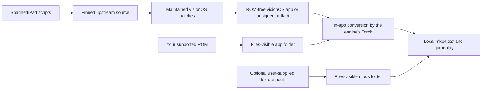

# Spaghetti-XR

<p align="center">
  <strong>Mario Kart 64 on Apple Vision Pro—drawn around you in a fully immersive space.</strong><br>
  Native Compositor Services rendering, per-eye stereo through the engine's own
  display lists, ARKit world-locking, PS VR2 Sense controllers, on-device ROM
  conversion, and optional enhanced texture packs.
</p>

<p align="center">
  
  
  
  
  
  
</p>

Vibe-forked from [SpaghettiPad](https://github.com/chrissotraidis/spaghettipad),
Sphagetti-XR packages the full
[SpaghettiKart](https://github.com/HarbourMasters/SpaghettiKart) source port as
a native visionOS app. The engine runs on Apple's Compositor Services inside a
fully immersive space, interprets each frame's display list once per eye against
that eye's own frustum, and anchors every presented frame to an ARKit device
pose so the world stays where you left it.

This repository contains the visionOS integration, maintained patches, and
reproducible build scripts. It does **not** contain Mario Kart 64, a ROM,
extractable or playable Nintendo game assets, a playable ROM-derived archive, or
MK64 Reloaded. Read the scoped
[rights and licensing boundary](RIGHTS_AND_LICENSES.md); it does not relicense
SpaghettiKart, its dependencies, texture packs, or game material.

> **This project pivoted from iPadOS to visionOS on 2026-08-01.** The iPadOS
> lane's released Preview 3 artifact still stands and its evidence is unchanged,
> but that lane is no longer maintained and its open gates were retired unmet.
> See [The retired iPadOS lane](#the-retired-ipados-lane).

## Two ways to see the game

**Mode B — the game around you.** The engine substitutes each eye's own frustum
and position for Mario Kart 64's projection matrix, so the world has real depth
and your head is the camera. Forward always follows the race camera; you look
around from wherever it has put you. The HUD and menus are handled separately:
their orthographic passes land on a fixed 4:3 panel 2.2 m ahead, world-locked,
so a cockpit instrument stays put when you turn your head. Prerendered
backdrops and race-wide fades ride a second panel 60 m out, behind the world
they stand behind.

**Mode A — a screen in the room.** The flat fallback: one picture of the game
on a world-locked screen inside the immersive space. Both eyes see the same
image, differing only in where it sits. This is what runs where there is no
second eye to draw — the Vision Pro Simulator, for one — and it is worth
keeping as somewhere to go back to.

The toggle is in the launch window, along with a world-scale slider: nothing in
the ROM says how large a Mario Kart 64 unit is, so whether the track reads as a
race circuit or a tabletop is your call, from about 20 mm to 150 mm per unit.

Opening the immersive space hides the launch window. The Digital Crown is the
way out, and leaving brings the window back.

**Where the room goes, and how to move it.** The screen, the HUD panel, the
floor and the sky are all hung off one head pose, taken shortly after the
immersive space opens — once your head has held still for half a second, so the
room is placed from where you settle rather than from wherever you happened to
be looking as it faded in. Only your position and which way you are facing are
read; looking down while it places costs nothing, because the room is levelled
either way. If it still ends up off to one side — you sat down afterwards, or
turned your chair — **hold both shoulders and both triggers together for a
second** and the room moves to where you are now.

## Current validation

This project keeps build, Simulator, and headset evidence separate, and says
which one every claim rests on. The Vision Pro Simulator **renders the left eye
only**, so no Simulator capture is ever evidence of stereo, world-locking, or
comfort.

| Area | Current result | Measured on |
|---|---|---|
| Native app | arm64 visionOS 26+ device and Simulator builds; mixed Swift, Objective-C++ and C++ under the Xcode generator | Both |
| Compositor | 89–90 Hz sustained, **every one of 33,601 presented drawables carrying an ARKit device anchor**, none dropped | Apple Vision Pro |
| Stereo separation | **67.0–70.7 mm** across six sessions, read from the compositor's own per-eye transforms | Apple Vision Pro |
| Mode A | Flat screen world-locked in the room; demonstrably stays put as the wearer turns | Apple Vision Pro |
| Mode B | The game renders in stereo on a wearer's face — first seen 2026-08-01. The **menu fill boxes are fixed on a wearer's face**; the four other fixes in that same build (HUD projection, camera factorisation, texture byte budget, backdrop panel) drew no complaint, which is not the same as each being checked. Two further changes are **built and unworn**: a menu fade the widescreen helpers shrank to a square, now full width and covering the whole view rather than a panel; and the room waiting for a still head before it places itself, plus a chord that recentres it | Apple Vision Pro, then build-only |
| HUD placement | A wearer found the HUD panel with its top-right corner at their visual centre. The panel was where it was told to go: it is world-locked to the pose the room was placed from, and that pose was **the first tracked frame after the space opened**. The room now waits for a still head, and can be recentred on demand. **Built and unworn** | Apple Vision Pro, then build-only |
| Comfort | A wearer drove a full race and won it, and reports the session as comfortable | Apple Vision Pro |
| Audio | The SDL/CoreAudio path is live and has been heard on device. The session declares a **Bypassed** spatial experience so closing the window does not silence a finished stereo mix | Apple Vision Pro |
| Controllers | A pair of **PS VR2 Sense** controllers enumerate as one combined gamepad and drove a race — buttons and sticks only. **Power both on before launching**: a pair switched on after launch reached the app as the right controller alone, which leaves the buttons working and the left stick — steering and menu selection — dead. Which layer dropped the left one is **not yet known**; the app now logs enough to name it | Apple Vision Pro |
| 6DoF steering | Holding the Sense pair like a steering wheel steers the kart: ARKit accessory tracking reports each controller separately, and the angle of the line between the hands drives port 0's stick. Off by default, with a sensitivity slider and a recentre. **Written and unworn** — it needs visionOS 27 and two tracked controllers, so the Simulator cannot exercise a single line of it | Build-only |
| ROM conversion | A clean container plus a user's `.z64` produces `mk64.o2r` in-app, with no host tooling involved | Simulator |
| Texture packs | The MK64 Reloaded 4K pack (1.18 GiB) imports, loads as `MK64-Reloaded-SK v2026.0.0`, and renders its own art; resident memory roughly triples | Simulator |
| Settings UI | The settings menu is a **native SwiftUI window**, not ImGui: the engine publishes its own widget tree — 3 sections, 12 pages, ~119 widgets — and the shell renders it with real visionOS controls. Nothing is transcribed, so a setting added upstream appears on its own. The ImGui menu still draws if the native window never presents, and still owns the Developer windows. **Built, not worn** — legibility was the open question and this is the answer to it, unmeasured | Simulator |
| Stability | A Mode B race was killed at 5 min 50 s by `JETSAM_REASON_MEMORY_PERPROCESSLIMIT` on **stock assets**, and a later session reached 8065 MiB of footprint with 126 MiB of headroom left. **A cause of the second was found and fixed**: evicting a texture cache entry never freed the texture behind it, because the Metal backend's `DeleteTexture` was an empty function, so live texture memory was the high-water mark of every slot the cache had ever used. That is a pack-sized leak and **does not explain the stock-asset kill**, which stays open. Fixed in the build, **unmeasured on a headset** | Apple Vision Pro |
| Packaging | `scripts/package-visionos.sh` produces an audited, ROM-free unsigned artifact with build provenance and a published SHA-256 | Build host |
| CI | Repository safety plus a ROM-free unsigned visionOS build/package workflow; **written, not yet run on a hosted runner** | — |

What is **not** claimed: that **6DoF steering works**, which is written and
compiles but has never been held by anyone — the Simulator reports no spatial
accessories and no accessory tracking, so nothing about it has run even once; a
**DualSense**, which has never been connected to this app; controller port order
across reconnects; multiplayer; on-device ROM
conversion; 4K-pack performance on the headset; and that the settings menu is
*legible* in a headset or that each page's widgets can be actuated there — only
that every page can be reached and selected with a pad.

A long session **may still end in a kill**. One cause of the growth above is
fixed and none of it is measured: no session since the fix has been worn, and
the 5 min 50 s kill on stock assets was a smaller curve than the one that
identified it. The compositor now reports live GPU texture memory beside the
cache's own figure every 600 frames, so the next wear either shows the two
tracking each other or names something the fix does not cover.

Two things the next wear should expect and not mistake for new defects: the game
CPU-culls to its own camera's frustum, so looking far off-axis shows geometry
popping in at the edges of what the game ever submitted; and the sky is
stretched to the backdrop panel, which is invisible on a gradient sky and will
look widened on a texture sky.

The [remaining-work ledger](docs/remaining-work.md) records the detailed proof
and every open gate; [the acceptance guide](docs/VISIONOS_DEVICE_ACCEPTANCE.md)
is the procedure that produced these results.

## Get started

You need:

- an Apple silicon Mac with an Xcode that ships the **visionOS 26 SDK or
  newer**, plus its command-line tools;
- [Homebrew](https://brew.sh);
- an Apple ID configured in Xcode if you want to run on a headset rather than
  the Simulator; and
- your own legally acquired Mario Kart 64 **US 1.0, big-endian `.z64`** ROM.

The supported ROM has SHA-1:

```text
579c48e211ae952530ffc8738709f078d5dd215e
```

Install the host dependencies. They are for the macOS *oracle* build, which
produces the ROM-free `spaghetti.o2r` the app ships; the visionOS build itself
cross-compiles everything it links:

```sh
brew install cmake ninja pkgconf sdl2 glew nlohmann-json libpng libzip \
  tinyxml2 libogg libvorbis opus opusfile sdl2_net ripgrep
```

Clone and build:

```sh
git clone https://github.com/chrissotraidis/spaghettipad.git
cd spaghettipad

# Vision Pro Simulator
scripts/build-visionos.sh --simulator

# Apple Vision Pro
DEVELOPMENT_TEAM=ABCDE12345 \
BUNDLE_ID=com.yourname.spaghettipad \
scripts/build-visionos.sh --device
```

Replace `ABCDE12345` with the 10-character team identifier shown in Xcode and
use a bundle identifier that belongs to you. Keep it unchanged for later update
installs so visionOS can retain the app container — and with it your converted
game archive, which takes minutes to rebuild.

Without `DEVELOPMENT_TEAM` the device build is produced unsigned and audited as
such. That artifact will not install on a headset; it is the reproducible proof
build, and re-signing it is your step.

The apps are written to:

```text
build-visionos-sim/Release-xrsimulator/SpaghettiPad.app
build-visionos/Release-xros/SpaghettiPad.app
```

If Xcode needs to register the device or create a provisioning profile, open
`build-visionos/Spaghettify.xcodeproj`, select the `Spaghettify` scheme and your
headset, then choose your team under **Signing & Capabilities**.

## First launch

SpaghettiPad never downloads or bundles game data.

1. Launch SpaghettiPad. The window reports what it found in its container.
2. Press **Import ROM…** and pick your supported `.z64`. You can also drop one
   into the app's Files-visible folder instead.
3. Press **Convert ROM to Game Data**.
4. Leave the app in front of you. The engine's own extractor scans the
   container and Torch builds `mk64.o2r` in place — several minutes, once, with
   a running elapsed count. Nothing is downloaded and nothing leaves the device.
5. When the window says the game data was found, press **Play**.

The ROM and the generated archive stay in the app container. Both are ignored by
Git and rejected by this repository's app and package audits.

If conversion fails, the app is killed by its own engine — those bail-outs run
before the game world exists, so exiting is the only safe form. The next launch
says the last attempt did not finish and points at `logs/` inside the container,
where the engine's full log is written. The most likely cause is a ROM that is
not the supported US 1.0 dump.

## Controllers

The engine's own SDL controller path drives the game. A pair of **PS VR2 Sense**
controllers enumerate as a single combined gamepad and have driven a full race
on hardware.

**Power both controllers on and let them connect before you launch the app.** A
pair switched on afterwards has reached the app as the right controller alone:
the buttons work, and the left stick — which is both steering and menu
selection — does nothing at all, because it is on the controller that never
arrived. Quit and relaunch with both already connected. The controls:

| Physical control | Mario Kart 64 input |
|---|---|
| Left stick | Analog stick / steering |
| South face button (cross) | A / accelerate |
| West face button (square) | B / brake and reverse |
| Left trigger | Z / use or hold an item |
| Right shoulder or trigger | R / hop and drift |
| Left shoulder | L |
| Options / Menu | Start |
| Right stick up/right | C-up / C-right |
| North/east face buttons | C-left / C-down |
| D-pad | N64 D-pad |
| Both stick clicks | Open and close the settings menu |
| Both shoulders **and** both triggers, held 1 s | Recentre the room on where you are now |

The last two are the app's, not the game's: they are read above SDL and never
reach an N64 port. The recentre chord needs the left shoulder, which Mario
Kart 64 does not use for anything, so dragging a shell through a drift — left
trigger and right shoulder together — cannot reach it by accident.

That describes the implemented path and one verified controller, not a blanket
certification. A DualSense has never been connected. Port order across
reconnects is unverified.

### Steering with your hands (6DoF), written and unworn

Turn on **Settings → General → 6DoF Steering** and hold both Sense controllers
where a steering wheel would be. Raising your right hand turns left, raising
your left hand turns right — the game reads the angle of the line between your
hands, not either hand's height on its own, so it does not care how far apart
you hold them or which way you are facing in the room. Full lock is about 40°
of wheel at the default sensitivity. The left stick wins whenever you push it,
and steering stops the moment either controller is put down or loses tracking.

**None of this has been used by a person.** It needs visionOS 27 and two
separately tracked controllers, and the Vision Pro Simulator provides neither,
so the whole feature is build-only: it compiles, it links, and no line of it has
executed. The 40° figure in particular is a considered guess with a 0.5×–2.0×
slider around it, and the number a wearer lands on is the one that should
replace it. `docs/VISIONOS_DEVICE_ACCEPTANCE.md` carries the acceptance steps.

## Texture packs

SpaghettiPad supports compatible SpaghettiKart `.o2r` texture packs but does
not provide, download, mirror, or relicense them. To use
[MK64 Reloaded](https://evilgames.eu/texture-packs/mk64-reloaded.htm):

1. Download the **SpaghettiKart `.o2r`** from the author's official page.
2. Press **Import Texture Pack…** in the launch window and pick it. A 4K pack
   is over a gigabyte; the copy is reported while it runs.
3. Turn on **Use enhanced textures**.

The switch is answerable and settable before the engine has started — it reads
and writes the engine's own saved console variable directly in that window, so
it tells the truth about a pack that is about to load. While the engine is
running the same switch reloads every texture live.

A 4K pack costs gigabytes of resident memory. The texture cache carries a
1 GiB byte budget as well as its entry count, and releases both the GPU texture
and the decoded CPU copy when it evicts, because a session on the headset was
previously ended by jetsam rather than by any crash. The GPU half of that
sentence became true on 2026-08-03: the budget had been dropping entries while
the textures behind them stayed allocated, which is how a session reached 8 GiB
with the cache inside its budget. Whether 1 GiB is the right number is a device
measurement that has not been taken.

## Reproducible and ROM-free



The normal compile never reads your ROM. `scripts/build-visionos.sh` fetches
exact upstream revisions, disables their push URLs, applies the maintained
patches, generates the ROM-free `spaghetti.o2r`, and builds the app. Your game
data is introduced only after installation.

To create an unsigned, re-signable package from an unsigned device build:

```sh
scripts/package-visionos.sh
```

The default command refuses a signed app. Locally signed packaging is an
explicit maintainer-only mode: `REQUIRE_SIGNED=1 scripts/package-visionos.sh`.
The packager audits the bundle and rejects Simulator products, original ROMs,
ROM-derived `mk64*.o2r`/`.otr` files, imported texture packs, unexpected port
archive contents, and stale signing material.

Every artifact carries a `BUILD_PROVENANCE.txt` recording the Xcode build, the
visionOS SDK, the three source revisions, and whether the working tree was
clean. That exists because this lane's active toolchain is a **beta Xcode**
(currently `27A5218g`), and no release may be published from one without saying
so. Set `SPAGHETTIPAD_EXPECTED_XCODE_BUILD` to make a specific toolchain a hard
gate.

The public package contract is an unsigned artifact that the installer signs
with their own Apple ID; do not distribute a maintainer development profile.

## Supported game

| Game | Engine | Status |
|---|---|---|
| **Mario Kart 64 US 1.0** | [SpaghettiKart](https://github.com/HarbourMasters/SpaghettiKart) | Supported |
| Other Nintendo 64 games or ROM revisions | Other source ports/emulators | Not supported by this app |

SpaghettiPad is a native integration of one source port, not a general
Nintendo 64 emulator. A different game or ROM revision cannot be substituted.

## The retired iPadOS lane

Before the 2026-08-01 pivot this project was a native iPhone/iPad port, and it
got far: Metal rendering, full-analog touch steering with a grip-first layout,
Files-based ROM import, four-port controller routing, split-screen, tilt
steering, and MK64 Reloaded HD, all exercised on physical hardware. **Preview 3
is published and its recorded evidence stands**, including an audited ROM-free
unsigned IPA whose exact payload was re-signed and launched on a physical
iPhone.

What that lane never closed — a complete touch-only Grand Prix, a complete
tilt-driven Grand Prix, physical controller model and reconnect coverage,
sustained multiplayer performance, and the final update/save-preservation
acceptance — is **superseded, not completed**. None of it becomes true by
abandonment, and none of it is claimed here.

The iPadOS build instructions, touch-control reference, and hardware acceptance
workflow are unchanged in [`docs/`](docs/); `scripts/build-ios.sh` and
`scripts/package-ios.sh` still reproduce that lane, and its CI workflow is kept
but no longer runs on push. Everything above this section is visionOS.

## Frequently asked questions

<details>
<summary><strong>Where is the visionOS build?</strong></summary>

There is no published visionOS artifact yet. Build it from source with
`scripts/build-visionos.sh`. The only published package this project has is the
iPadOS [Preview 3 IPA](https://github.com/chrissotraidis/spaghettipad/releases/tag/v0.1.0-preview.3),
which belongs to the retired lane.
</details>

<details>
<summary><strong>Does this repository include Mario Kart 64?</strong></summary>

No. You must provide your own legally acquired supported ROM. Do not open
issues requesting game data, extracted assets, or download links.
</details>

<details>
<summary><strong>Does it work in the Vision Pro Simulator?</strong></summary>

Partly, and the part it cannot do is the interesting one. The Simulator reports
a single view, so the stereo path declines there by design and only the flat
Mode A fallback runs. It also cannot emulate Sense controllers. It is useful for
the launch window, ROM conversion, texture packs, and Mode A — and it is never
evidence about stereo, world-locking, or comfort.
</details>

<details>
<summary><strong>Why does conversion take so long, and why in the app?</strong></summary>

Torch decodes every texture, display list, course, and audio bank in the ROM
into the engine's archive format. Doing it on the headset rather than on a Mac
is what keeps the workflow honest: the ROM is yours, it never leaves your
device, and nothing ROM-derived is ever built by this repository's CI.
</details>

<details>
<summary><strong>Can the 4K texture pack be bundled?</strong></summary>

No. Texture packs remain optional third-party content obtained by the user from
the pack author's official page. SpaghettiPad only provides the import and
enable/disable workflow.
</details>

<details>
<summary><strong>Is this an App Store or TestFlight release?</strong></summary>

No. None should be implied until that exact path is published and tested.
</details>

<details>
<summary><strong>What is the licensing status?</strong></summary>

Each upstream component retains its own license and copyright. The pinned
SpaghettiKart revision has no top-level license, so this project does not
represent its binary-redistribution terms as settled. See
[RIGHTS_AND_LICENSES.md](RIGHTS_AND_LICENSES.md); public source access does not
grant rights to Nintendo material or third-party texture packs.
</details>

## Project map

| Path | Purpose |
|---|---|
| [`visionos/`](visionos/) | The app shell: SwiftUI lifecycle, Compositor Services renderer, render surface, world tracking |
| [`scripts/build-visionos.sh`](scripts/build-visionos.sh) | Complete Simulator or device build from pinned sources |
| [`scripts/package-visionos.sh`](scripts/package-visionos.sh) | Audited unsigned/signed visionOS packaging with build provenance |
| [`scripts/audit-visionos-app.sh`](scripts/audit-visionos-app.sh) | ROM-free app-bundle contract: platform, architecture, frameworks, archive hashes, signing |
| [`scripts/run-visionos-sim-extraction.sh`](scripts/run-visionos-sim-extraction.sh) | Clean-container in-app ROM conversion run on the Simulator |
| [`scripts/check-repo-safety.sh`](scripts/check-repo-safety.sh) | Tracked-asset, history, patch, script, and documentation gate |
| [`patches/`](patches/) | Reviewable SpaghettiPad changes replayed onto pinned upstream source |
| [`docs/VISIONOS_DEVICE_ACCEPTANCE.md`](docs/VISIONOS_DEVICE_ACCEPTANCE.md) | Apple Vision Pro acceptance workflow |
| [`docs/remaining-work.md`](docs/remaining-work.md) | Evidence ledger and remaining gates |
| [`docs/BUILDING.md`](docs/BUILDING.md) | Retired lane: full iOS build, signing, and package-audit guide |
| [`docs/INSTALL_IPA.md`](docs/INSTALL_IPA.md) | Retired lane: unsigned developer-preview installation boundary |
| [`docs/HARDWARE_ACCEPTANCE.md`](docs/HARDWARE_ACCEPTANCE.md) | Retired lane: physical iPhone/iPad validation workflow |
| [`docs/TOUCH_CONTROLS.md`](docs/TOUCH_CONTROLS.md) | Retired lane: touch layout, editor behavior, and validation |
| [`docs/RELEASE_CHECKLIST.md`](docs/RELEASE_CHECKLIST.md) | Source and package publication gates |
| [`RIGHTS_AND_LICENSES.md`](RIGHTS_AND_LICENSES.md) | Project, upstream, and game-data rights boundary |

Generated source trees, builds, artifacts, ROMs, ROM-derived archives, texture
packs, device evidence, and signing identifiers are ignored and must never be
committed.

## Credits and legal

SpaghettiPad exists because of
[SpaghettiKart](https://github.com/HarbourMasters/SpaghettiKart),
[libultraship](https://github.com/Kenix3/libultraship),
[Torch](https://github.com/HarbourMasters/Torch), SDL,
[SDL_GameControllerDB](https://github.com/mdqinc/SDL_GameControllerDB), and
their contributors. Mode B's classification of 2D draws was read out of
[RT64](https://github.com/rt64/rt64), which is MIT-licensed; no RT64 code was
copied. Its mobile control work draws on lessons from
[HarkinianPad](https://github.com/chrissotraidis/harkinianpad), while
[MK64 Reloaded](https://evilgames.eu/texture-packs/mk64-reloaded.htm) is an
independent, optional user-supplied visual pack.

SpaghettiPad is an unofficial community project and is not affiliated with or
endorsed by Nintendo, Harbour Masters, or the MK64 Reloaded project. Nintendo,
Mario, and Mario Kart are trademarks of Nintendo. All projects, copyrights,
and trademarks belong to their respective owners.
